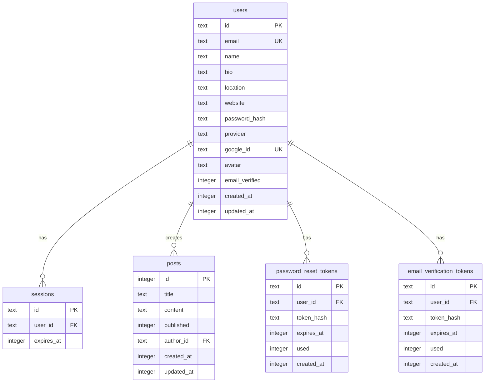

# Technical Design Document (TDD)

## 1. Architecture Overview

### 1.1 Tech Stack

| Layer | Technology |
|-------|------------|
| Framework | SvelteKit 2.x |
| UI Library | Svelte 4.x |
| Styling | Tailwind CSS 3.4 |
| Database | Cloudflare D1 (SQLite) |
| ORM | Drizzle ORM 0.29 |
| Auth | Lucia Auth 3.x + Arctic |
| Password Hashing | Web Crypto API (PBKDF2) |
| Email | Resend |
| Storage | Cloudflare R2 |
| Image Processing | Canvas API (WebP) |
| Build Tool | Vite 5.x |
| Adapter | @sveltejs/adapter-cloudflare |
| Deployment | Cloudflare Pages |

### 1.2 System Architecture

```
┌─────────────────────────────────────────────────────────────┐
│                        Client (Browser)                      │
│  ┌─────────────┐  ┌─────────────┐  ┌─────────────────────┐  │
│  │   Svelte    │  │ Tailwind CSS│  │   Lucide Icons      │  │
│  └─────────────┘  └─────────────┘  └─────────────────────┘  │
└──────────────────────────┬──────────────────────────────────┘
                           │ HTTP
┌──────────────────────────▼──────────────────────────────────┐
│                   Cloudflare Edge Network                    │
│  ┌─────────────────────────────────────────────────────────┐ │
│  │           Cloudflare Pages (Static Assets)              │ │
│  └─────────────────────────────────────────────────────────┘ │
│  ┌─────────────────────────────────────────────────────────┐ │
│  │           Cloudflare Workers (Server Logic)             │ │
│  │  ┌─────────────┐  ┌─────────────┐  ┌─────────────────┐  │ │
│  │  │  SvelteKit  │  │  Lucia Auth │  │  Drizzle ORM    │  │ │
│  │  │   Server    │  │             │  │                 │  │ │
│  │  └─────────────┘  └─────────────┘  └─────────────────┘  │ │
│  └─────────────────────────────────────────────────────────┘ │
│  ┌─────────────────────────────────────────────────────────┐ │
│  │           Cloudflare D1 (SQLite Database)               │ │
│  └─────────────────────────────────────────────────────────┘ │
│  ┌─────────────────────────────────────────────────────────┐ │
│  │           Cloudflare R2 (Object Storage)                │ │
│  └─────────────────────────────────────────────────────────┘ │
└─────────────────────────────────────────────────────────────┘
```

### 1.3 Project Structure

```
.
├── src/
│   ├── lib/
│   │   ├── auth/           # Lucia auth configuration
│   │   ├── db/             # Drizzle ORM schema dan client
│   │   ├── email/          # Resend email templates
│   │   ├── image/          # Image processing utilities
│   │   ├── storage/        # R2 storage utilities
│   │   └── components/     # Reusable Svelte components
│   ├── routes/
│   │   ├── (app)/          # Group route untuk app pages
│   │   ├── api/            # API endpoints
│   │   ├── auth/           # Auth pages
│   │   └── ...             # Other routes
│   ├── app.html            # HTML template
│   ├── app.css             # Global styles
│   └── hooks.server.ts     # Server hooks (auth & DB injection)
├── drizzle/                # Database migrations
├── workflow/               # Project documentation
├── static/                 # Static assets
└── ...config files
```

---

## 2. Database Design

### 2.1 Schema Overview



### 2.2 Table Definitions

#### users
| Column | Type | Constraints | Description |
|--------|------|-------------|-------------|
| id | TEXT | PRIMARY KEY | UUID v7 |
| email | TEXT | NOT NULL, UNIQUE | User email |
| name | TEXT | NOT NULL | Display name |
| bio | TEXT | | User biography |
| location | TEXT | | Location |
| website | TEXT | | Personal website |
| password_hash | TEXT | | Hashed password (null for OAuth) |
| provider | TEXT | | 'email' atau 'google' |
| google_id | TEXT | UNIQUE | Google OAuth ID |
| avatar | TEXT | | Profile picture URL |
| email_verified | INTEGER | | Boolean (0/1) |
| created_at | INTEGER | | Unix timestamp |
| updated_at | INTEGER | | Unix timestamp |

#### sessions (Lucia Auth)
| Column | Type | Constraints | Description |
|--------|------|-------------|-------------|
| id | TEXT | PRIMARY KEY | Session ID |
| user_id | TEXT | NOT NULL, FK | References users.id |
| expires_at | INTEGER | | Unix timestamp |

#### posts (Example Extension)
| Column | Type | Constraints | Description |
|--------|------|-------------|-------------|
| id | INTEGER | PRIMARY KEY AUTOINCREMENT | Post ID |
| title | TEXT | NOT NULL | Post title |
| content | TEXT | | Post content |
| published | INTEGER | | Boolean (0/1) |
| author_id | TEXT | FK | References users.id |
| created_at | INTEGER | | Unix timestamp |
| updated_at | INTEGER | | Unix timestamp |

### 2.3 Relationships

- **users → sessions**: One-to-Many (One user has many sessions)
- **users → posts**: One-to-Many (One user creates many posts)
- **users → password_reset_tokens**: One-to-Many
- **users → email_verification_tokens**: One-to-Many

---

## 3. API Design

### 3.1 API Patterns

**Server Load Pattern (GET requests):**
```typescript
// +page.server.ts
export const load = async ({ locals }) => {
  const data = await locals.db.query.table.findMany();
  return { data };
};
```

**Form Actions Pattern (POST/PUT/DELETE):**
```typescript
// +page.server.ts
export const actions = {
  actionName: async ({ request, locals }) => {
    const form = await request.formData();
    // Process and return
  }
};
```

**API Routes Pattern (JSON API):**
```typescript
// +server.ts
export const GET = async ({ locals }) => {
  return json(data);
};
```

### 3.2 Authentication Endpoints

| Method | Endpoint | Description |
|--------|----------|-------------|
| POST | `/auth/register` | Register with email/password |
| POST | `/auth/login` | Login with email/password |
| POST | `/auth/logout` | Logout current session |
| GET | `/auth/google` | Initiate Google OAuth |
| GET | `/auth/google/callback` | Google OAuth callback |
| POST | `/auth/forgot-password` | Request reset token |
| POST | `/auth/reset-password` | Reset password |
| GET | `/auth/verify-email` | Verify email with token |
| POST | `/auth/resend-verification` | Resend verification email |

### 3.3 API Endpoints

| Method | Endpoint | Description | Auth |
|--------|----------|-------------|------|
| GET | `/api/health` | Health check | No |
| GET | `/api/profile` | Get current user profile | Yes |
| PUT | `/api/profile` | Update profile | Yes |
| GET | `/api/users` | List all users | Yes |
| POST | `/api/users` | Create new user | Yes |
| GET | `/api/users/[id]` | Get user by ID | Yes |
| DELETE | `/api/users/[id]` | Delete user | Yes |
| POST | `/api/upload/presign` | Get presigned URL for R2 | Yes |
| POST | `/api/upload/image` | Upload image to R2 | Yes |
| DELETE | `/api/upload/image` | Delete image from R2 | Yes |

### 3.4 Request/Response Format

**Success Response:**
```json
{
  "success": true,
  "data": { ... }
}
```

**Error Response:**
```json
{
  "success": false,
  "error": "Error message"
}
```

---

## 4. Data Flow

### 4.1 Authentication Flow

```
┌──────────┐    ┌──────────┐    ┌──────────┐    ┌──────────┐
│  Client  │───▶│ SvelteKit│───▶│  Lucia   │───▶│    D1    │
│          │    │  Server  │    │   Auth   │    │   DB     │
└──────────┘    └──────────┘    └──────────┘    └──────────┘
     │                │                │                │
     │  1. Login      │                │                │
     │───────────────▶│                │                │
     │                │  2. Validate   │                │
     │                │────────────────▶│                │
     │                │                │  3. Query      │
     │                │                │────────────────▶│
     │                │                │  4. User data  │
     │                │                │◀───────────────│
     │                │  5. Session    │                │
     │                │◀───────────────│                │
     │  6. Set cookie │                │                │
     │◀───────────────│                │                │
```

### 4.2 Data Loading Flow

```
Page Request
    │
    ▼
+page.server.ts load()
    │
    ▼
locals.db.query (Drizzle)
    │
    ▼
Cloudflare D1
    │
    ▼
Return data to +page.svelte
```

### 4.3 Form Submission Flow

```
Form Submit
    │
    ▼
+page.server.ts actions
    │
    ▼
Validation (Zod)
    │
    ▼
locals.db operations (Drizzle)
    │
    ▼
Cloudflare D1
    │
    ▼
Return result/redirect
```

---

## 5. Security Considerations

### 5.1 Authentication & Authorization

- **Session-based auth** dengan Lucia Auth
- **HttpOnly cookies** untuk session tokens
- **CSRF protection** via SvelteKit
- **Secure flag** untuk cookies di production
- **Rate limiting** untuk auth endpoints

### 5.2 Data Protection

- **Password hashing** dengan PBKDF2 (Web Crypto API)
- **Input validation** dengan Zod
- **SQL injection prevention** via Drizzle ORM
- **XSS prevention** via Svelte's auto-escaping

### 5.3 Environment Security

- **Environment variables** disimpan di `.env`
- **Secrets** tidak di-commit ke git
- **API tokens** dengan scope minimal

---

## 6. Performance Considerations

### 6.1 Edge Optimization

- **Edge deployment** via Cloudflare Pages/Workers
- **Global CDN** untuk static assets
- **D1 database** runs on Cloudflare's edge network

### 6.2 Caching Strategy

- **Static assets**: Cache-Control headers
- **API responses**: Cacheable jika data jarang berubah
- **CDN caching**: Leverage Cloudflare's cache

### 6.3 Bundle Optimization

- **Code splitting** via Vite
- **Tree shaking** untuk unused code
- **Dynamic imports** untuk heavy components

---

## 7. Error Handling

### 7.1 Error Types

| Type | HTTP Status | Description |
|------|-------------|-------------|
| ValidationError | 400 | Invalid input data |
| AuthenticationError | 401 | Not authenticated |
| AuthorizationError | 403 | Not authorized |
| NotFoundError | 404 | Resource not found |
| ServerError | 500 | Internal server error |

### 7.2 Error Handling Pattern

```typescript
// In load function
try {
  const data = await locals.db.query.table.findMany();
  return { data };
} catch (error) {
  console.error('Database error:', error);
  return { error: 'Failed to load data' };
}

// In form action
try {
  await locals.db.insert(table).values(data);
  return { success: true };
} catch (error) {
  return fail(500, { error: 'Failed to save data' });
}
```

---

## 8. Deployment

### 8.1 Deployment Flow

```
Local Development
    │
    ▼
npm run build
    │
    ▼
Cloudflare Workers (Adapter)
    │
    ▼
npm run deploy (wrangler)
    │
    ▼
Cloudflare Pages
```

### 8.2 Environment Configuration

**Development:**
```bash
npm run dev          # Local dev server
npm run db:migrate:local  # Local D1
```

**Production:**
```bash
npm run build        # Production build
npm run db:migrate   # Remote D1
npm run deploy       # Deploy to Cloudflare
```

### 8.3 Wrangler Configuration

```toml
# wrangler.toml
name = "your-project"
compatibility_date = "2024-01-01"

[[d1_databases]]
binding = "DB"
database_name = "your-database"
database_id = "your-database-id"
```

---

## 9. Testing Strategy

### 9.1 Testing Levels

| Level | Tool | Scope |
|-------|------|-------|
| Unit | Vitest | Individual functions |
| Integration | Vitest | Database operations |
| E2E | Playwright | Full user flows |

### 9.2 Test Commands

```bash
npm run test:unit        # Unit tests
npm run test:integration # Integration tests
npm run test:e2e         # E2E tests
```

---

## 10. Appendices

### 10.1 Glossary

- **D1**: Cloudflare's edge SQLite database
- **R2**: Cloudflare's object storage (S3-compatible)
- **Workers**: Cloudflare's serverless compute platform
- **Drizzle**: Type-safe SQL-like ORM
- **Lucia**: Session-based authentication library

### 10.2 References

- [SvelteKit Docs](https://kit.svelte.dev/docs)
- [Lucia Auth Docs](https://lucia-auth.com/)
- [Drizzle ORM Docs](https://orm.drizzle.team/)
- [Cloudflare D1 Docs](https://developers.cloudflare.com/d1/)
- [Tailwind CSS Docs](https://tailwindcss.com/docs)

### 10.3 Change Log

| Date | Version | Changes | Author |
|------|---------|---------|--------|
| [YYYY-MM-DD] | 1.0.0 | Initial draft | [Name] |
